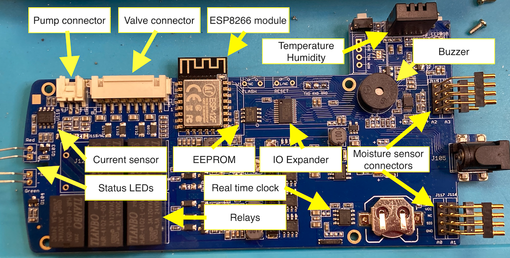
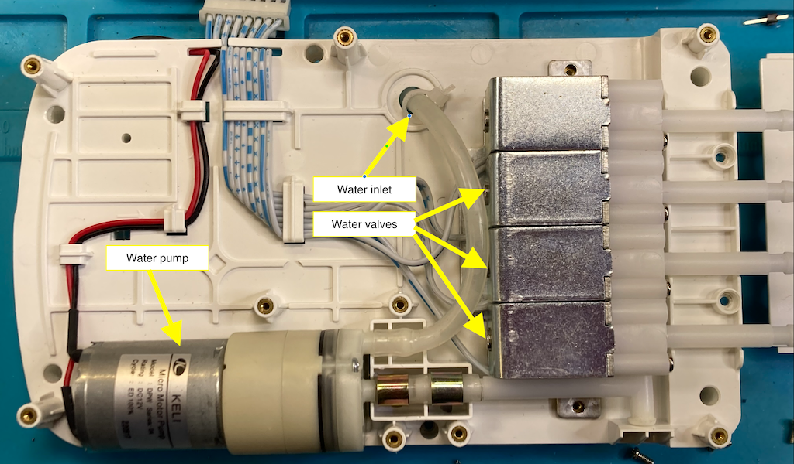

# GrowCube_Hacking

These are my notes reverse engineering the protocol used in Growcube. 

> Note: This is still a work in progress

## Hardware


[Bigger image](assets/growcube_hardware.png)


[Bigger image](assets/growcube_hardware2.png)

## Tools used

I used Jadx to reverse engineer the Android app to get some insights in how the protocol works. 

I used Airtool 2 to sniff network traffic between the app and the device. You connect the phone via USB and tell it to sniff all traffic on the phone, it then fires up Wireshark with the result.

## Goal

The end goal of this project was to create a Python Growcube client library, and ultimately a proper Home Assistant integration.

The Python client is available on [PyPi](https://pypi.org/project/growcube-client/) , and repository is located [here](https://github.com/jonnybergdahl/Python-growcube-client).
This repository also contains scripts to discover devices on the network, as well as a complete app that talks to a device. 


The Home Assistant integration repository is located [here](https://github.com/jonnybergdahl/homeassistant_growcube).

## Android app reverse engineering

Static values in `NetConstant`:
```Java
    public static final int CONNCECT_BROKEN = 66;
    public static final int CONNCET_DEVICE_FAIL = 18;
    public static final int CONNCET_DEVICE_SUC = 17;
    public static final int DEVICE_CLOSE_PUMP_SUC = 69;
    public static final int DEVICE_OPEN_PUMP_SUC = 70;
    public static final int DEVICE_REC_CURVE_DATA = 71;
    public static final int DEVICE_REC_STH_DATA = 72;
    public static final int DEVICE_REC_WATER_VOLUME_DATA = 73;
    public static final int DEVICE_VERSION_UPDATE = 67;
    public static final int DEVICE_WIFI_NOT_CONFIG = 19;
    public static final int LISTEN_SERVER_FAIL = 34;
    public static final int LISTEN_SERVER_SUC = 33;
    public static final int PLANT_WATER_DATA_CHANGE = 80;
    public static final int UPDATE_WIKI_DATA = 81;
    public static final int WATER_CLOSE_OPEN_TIME_OUT = 53;
    public static final int WATER_CLOSS_FAIL = 51;
    public static final int WATER_CLOSS_SUC = 52;
    public static final int WATER_OPEN_FAIL = 50;
    public static final int WATER_OPEN_SUC = 49;
```

Static values in `NetManagerImp`: 
```Java
    public static final int CONNECT_PORT = 8800;
    public static final String IP_WIFI_SETTING = "192.168.1.125";
    private static final String KEY_CONNECT = "connect_device";
    private static final String KEY_CROW_RANDOM_NAME = "key_crow_random_name";
    public static final int PORT_BROCAST = 9527;
    public static final int PORT_WIFI_SETTING = 8800;
```

The class `NetManagerImp` is responsible for communication with the Growcube. Functions in that class that seems interesting to implement in the Python library:

  - `water(i, i2)` (ReqWater(i, i2))
  - `getCurveData(i)` (ReqCurveData(i))
  - `setWaterMode(i, i2. i3. i4)` (ReqWaterMode(i, i2, i3, i4))
  - `closeAotuMode(i)` (ReqClosePump(i))
  - `erasePlantCurveData(i)` (ReqPlantEnd(i))
  - `closeOutdoorMode(i)` (ReqSetWorkmode(0))
  - `openOutdoorMode()` (ReqSetWorkmode(1))

 And maybe:

  - `configWifi()`
  - `clearCurWifiInfo()`
  - `upgradeDevice()`
  - `restoreFactoryMode()`


There seems to be some kind of auto discovery implemented in `NetManagerImp`. Sniffing network traffic has not revelead any of theses packages, so I don't think it is used.

```Java
sendBracastMsg(PORT_BROCAST, "crowcube", new INetCallback()
...
DatagramPacket datagramPacket = (DatagramPacket) obj;
                            String hostAddress = datagramPacket.getAddress().getHostAddress();
                            String str = new String(datagramPacket.getData(), 0, datagramPacket.getLength());
                            LogUtil.d("ip:" + hostAddress + " id:" + str + " curid:" + NetManagerImp.curDevice.getIp());
```

### GUI

When the app connects to the device it waits for the device id and firmware version report. It then makes a HTTP request to `https://www.growcube.cc/software/2.4G/?v=<firmware version>`. It checks the return body
for the text `当前已是最新版本!` (Translation: Currently the latest version!). If not, the returned string is the url to the latest firmware version, like in
`https://www.growcube.cc/software/2.4G/GrowCube-Software_ESP8266_V4.1_2023-12-08.bin`.

It then continues to listen for messages. When a message is rececived from the device it creates a `Message` that is submitted to the `com.elecrow.crowcube.ui.frg.onMsgReceive(msg)` function. This uses the field `msg.what` to identify what the message means.

For the device messages, this mapping is used.

Command value | msg.what | Comment
---- | ----
20 | 73 | Displays the dialog "Water shortage reminder"
21 | 72 | Handle temperature and humidity
22 | 71 | Not handled in `onMsgReceive()` 
24 | 67 | If not connected to a WiFi named Growcube_*, switches to the update dialog
26 | 70 | calls pumpOperationSucceded(arg, 1) - Decompile problem, but probably "pump open", This also updates the history.
27 | 69 | calls pumpOperationSucceded(arg, 0) - Decompile problem, but probably "pump closed", This also updates the history.
28 | 84 | Displays the dialog "Soil moisture sensor abnormality"
29 | 85 | Displays the dialog "Device is blocked"
30 | 89 | Displays the dialog "Soil moisture sensor is disconnected"
31 | 86 | (Not handled) 
32 | 87 | (Not handled)
33 | 88 | Dialog "Device is locked." Data = x@n - n=1: lowWaterLock(), n=2: duZhuanLock()
34 | 98 | Displays the dialog "The outlet is locked"

#### Dialogs

Dialog | Text
---- | ----
Water shortage reminder | GrowCube is out of water, please fill it now.
Soil moisture sensor abnormality | Sensor `str` is abnormall, please check:please check whether it is damaged or improperly inserted
Device is blocked | GrowCube is blocked, please check whether the water outlet, water pipe and nozzle are blocked.
Soil moisture sensor is disconnected | Sensor `str` is not connected, please check whether it is connected normally.
Device is locked. | lowWaterLock = "Due to water shortage, GrowCube is locked. Please add water now and press the unlock button to unlock the GrowCube." duZhuanLock = "Due to the blocked up, GrowCube is locked. Please check the water outlet and water pipe immediately, and then press the unlock button to unlock GrowCube."
The outlet is locked | Due to the sensor `str` is abnormall, the outlet `str.toLowerCase()` is locked. Please re-plug sensor `str` or replace with another sensor, and then press the unlock button to unlock GrowCube.

## Communication

The device has an open TCP port on 8800. Connect to that using a raw socket, and it starts to periodically write out messages. It also support accepting commands.

This is a sample output running Telnet, I just added a line feed to separate different messages.

```
Connected to 172.30.2.202.
Escape character is '^]'.
elea24#12#3.6@12663500#
elea28#1#0#
elea28#1#1#
elea28#1#3#
elea33#3#0@0#
elea21#10#0@26@45@25#
elea21#10#1@17@45@25#
elea21#10#2@23@45@25#
elea21#10#3@15@45@25#
```

Using Wireshark reveals the server is actually sending more data than what Telnet shows, a detail a parser will need to deal with.

``` pcap
0000   00 08 a2 0f 0f 3e a8 48 fa c1 3a cc 08 00 45 00   .....>.H..:...E.
0010   00 be 96 be 00 00 ff 06 c8 83 ac 1e 02 46 ac 1e   .............F..
0020   01 75 22 60 fa 7f 00 00 c9 85 92 1d 31 b0 50 18   .u"`........1.P.
0030   08 5e 2f 58 00 00 65 6c 65 61 32 31 23 31 30 23   .^/X..elea21#10#
0040   31 40 32 39 40 33 30 40 32 34 23 00 00 00 00 00   1@29@30@24#.....
0050   00 00 00 00 00 00 00 00 00 00 00 00 00 00 00 00   ................
0060   00 00 00 00 00 00 00 00 65 6c 65 61 32 31 23 31   ........elea21#1
0070   30 23 32 40 33 34 40 33 30 40 32 34 23 00 00 00   0#2@34@30@24#...
0080   00 00 00 00 00 00 00 00 00 00 00 00 00 00 00 00   ................
0090   00 00 00 00 00 00 00 00 00 00 65 6c 65 61 32 31   ..........elea21
00a0   23 31 30 23 33 40 33 36 40 33 30 40 32 34 23 00   #10#3@36@30@24#.
00b0   00 00 00 00 00 00 00 00 00 00 00 00 00 00 00 00   ................
00c0   00 00 00 00 00 00 00 00 00 00 00 00               ............
```

### App communication

#### App startup

When the app starts, it connects to the Growcube and starts communication. 

The app starts by sending a `SyncTime` command with the current data and time. 
The device responds with a `RepVersionAndWater` response.

```
> elea44#19#2023@07@12@22@49@05#
< elea24#12#3.6@12663500#
```

The app sends a `SetWorkmode` command for mode `2`. It then continues
asking for data with a `CurveData` command for plant 0.

```
> elea43#1#2#
< elea33#3#0@0#
```

Enter plant #1 in  the app. It requests watering data and receives a bunch of packets, one for each
date. 
```
> elea48#1#0#
< elea22#83#0@2023@7@12@00,00,00,00,00,00,00,00,00,00,00,00,00,00,00,00,00,00,00,00,00,95,96,00#
< elea22#83#0@2023@7@13@00,00,00,00,00,00,00,00,00,00,00,00,00,00,00,00,00,00,00,00,00,00,00,00#
..
< elea22#83#0@2023@8@10@00,00,00,00,00,00,00,00,00,00,00,00,00,00,00,00,00,00,00,00,00,00,00,00#
```

#### Request start watering

```
> elea47#3#0@1#
< elea26#1#0#
> ele506 ??
< elea21#9#0@0@46@23#
< ele550
```

#### Request stop watering

> elea47#3#0@0#
< elea27#1#0#


#### Idle traffic
The Growcube continually sends out a "current state" data stream.

```
< elea35#3#0@1#elea23#16#0@2023@6@19@6@38#
< elea35#3#0@1#elea23#16#0@2023@6@19@6@38#
< elea23#16#0@2023@6@19@6@40#
< elea23#16#0@2023@6@19@6@42#elea23#17#0@2023@6@22@18@21#
< elea23#17#0@2023@6@22@18@23#
< elea23#17#0@2023@6@22@18@25#
< elea23#16#0@2023@6@26@0@18#
< elea23#16#0@2023@6@26@0@21#
< elea23#16#0@2023@6@26@0@23#elea23#16#0@2023@6@26@0@25#elea23#15#0@2023@7@1@22@5#

```

#### Connect when device is out of water

```
> elea44#19#2023@08@10@19@59@31#
< elea24#11#3.6@2432941#
< elea33#3#1@1#
> elea43#1#2#
< elea21#9#0@0@47@23#
```

## Message format

The messages are composed by the following parts.

Part | Description
---- | ----
"elea" | Message header
XX | Command/Response
"#" | Delimiter
NN | Length of the following data
data | Data, delimited by # delimiters and sub delimited by @ characters
"#" | End of data

## Response values

These are the "response" values as defined in the app.

Value | Description | Attributes                                              | Sample value
---- | ---- |---------------------------------------------------------| ----
20 | RepWaterState | Water warning                                           | waterEnough = 1
21 | RepSTHSate | pump #, "st", "th", temperature                         | 0@50@49@24
22 | RepCurveCmd | Pump data, pumpnum, yearData[], monthData[], dateData[] |
23 | RepAutoWaterCmd | pump #, time stamp divided (year, month, day, h, m)     |
24 | RepDeviceVersionCmd | version number, device num                              | 3.6@12663500
25 | RepErasureData | Erasure state                                       | elea25#3#52d# == true
26 | RepPumpOpenCmd | pump #                                                  | 3
27 | RepPumpCloseCmd | pump #                                                  | 3
28 | ReqCheckSenSorCmd | sensor #                                      | 1 
29 | ReqCheckDuZhuanCmd | pump outlet fault state                                 | 3
30 | ReqCheckSenSorNotConnectCmd | state                                                   | 
31 | RepWifistateCmd | state                                                   |
32 | RepGrowCubeIPCmd | GrowCube IP                                             | ???
33 | RepLockstateCmd | Sensor fault state                                       | 0@0 / 1@1
34 | ReqCheckSenSorLockCmd | sensor locked state                                     | 3
35 | RepCurveEndFlagCmd | ? end flag                                              | 0@1

There also seems to be some responses that does not use the normal syntax.

Value | Description
---- | ----
ele550 |Response to ele506?

## Command values

These are the command values as defined in the app.

Value | Description | Attributes
---- | ---- | ---
28 | ReqSensorExceFlagCmd | pump #
43 | ReqSetWorkmodeCmd / ReqDirectConnModel | mode / modelType
44 | ReqSyncTime | Current time
45 | ReqPlantEnd | pump #
46 | ReqClosePump | pump #
47 | ReqWater | pump #, state, 1 = Start pump, 0 = Stop pump 
48 | ReqCurveData | pump #
49 | ReqWaterMode | pump #, mode, min value, max value
50 | ReqWifiSettings | WiFi name, WiFi password, "time mils" = KEY_DEVICE_ID

 > For command 49, mode 0 = Smart mode settings, 1 = Smart mode outside of daylight, 2 = Manual mode. <br>
 For Manual mode the last two values are interval and duration. 
 

There also seems to be some commands that does not use the normal syntax.

Value | Description
---- | ---
ele502 | SyncWaterLevelCmd
ele503 | SyncWaterTimeCmd
ele504 | ReqDeviceUpgradeCmd
ele505 | ReqFactoryResetCmd
ele506 | CheckDeviceOnlineCmd
ele507 | ResetNetWrokModelCmd

 > Note: Any misspelled request/resonse words are directly copied from the source code.

